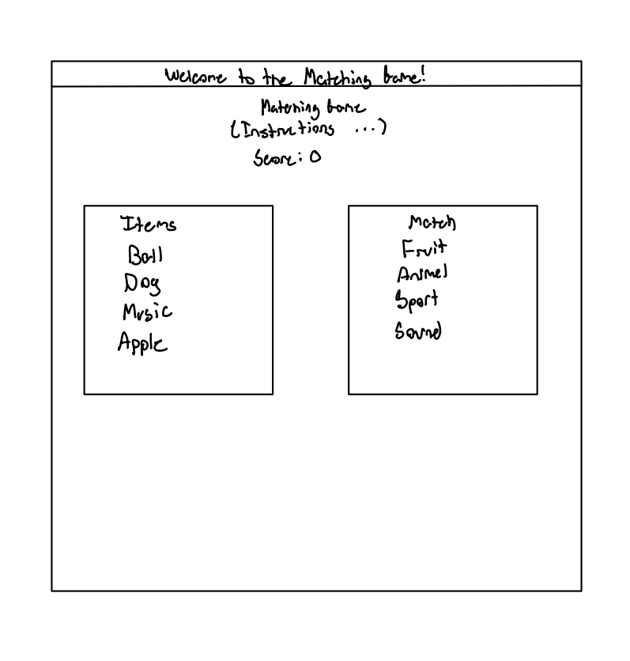

# Project Bravo

## Project

A small matching game made with HTML, CSS, and JS.

## Wireframe

A simple wireframe for the Matching Game.



## Code Block
```js
$(function () {
  // Make draggables
  $(".draggable").draggable({
    revert: "invalid",
  });

```
This function is what allows our objects to be draggable. Using JQuery UI we can declare anything that has the class "draggable" to now be draggable. Also, note that we gave it the arguement revert to be invalid. If the object you are dragging is not accepted into the proper dropzone, it reverts to its starting position.

## Resources

- [Drag and Drop Functionality](https://coderscratchpad.com/drag-and-drop-functionality-with-jquery-ui/)
- [Array Sort](https://developer.mozilla.org/en-US/docs/Web/JavaScript/Reference/Global_Objects/Array/sort)
- [Math.random](https://developer.mozilla.org/en-US/docs/Web/JavaScript/Reference/Global_Objects/Math/random)
- [Shuffle Using an Array](https://www.geeksforgeeks.org/javascript/how-to-shuffle-an-array-using-javascript/)
- [Color Scheme Generator](https://colorffy.com/dark-theme-generator?colors=ed1ca7-121212)

